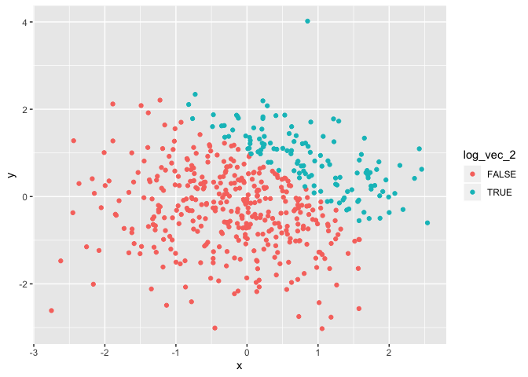
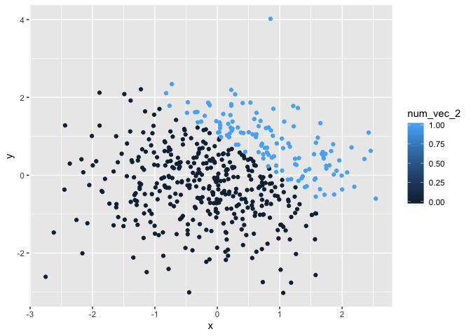
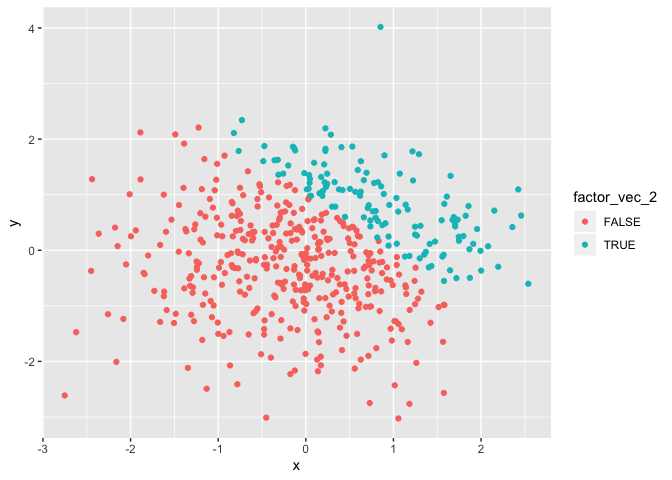

p8105\_hw1\_mk4022.Rmd
================
Mary Knoop
9/17/2019

HW 1 Problem 1: Part A Create a data frame comprised of:

a random sample of size 8 from a standard Normal distribution, a logical
vector indicating whether elements of the sample are greater than 0, a
character vector of length 8, and a factor vector of length 8, with 3
different factor “levels”

``` r
#create dataframe
library(tidyverse)
```

    ## ── Attaching packages ────────────────────────────────────────────────────────────────────── tidyverse 1.2.1 ──

    ## ✔ ggplot2 3.2.1     ✔ purrr   0.3.2
    ## ✔ tibble  2.1.3     ✔ dplyr   0.8.3
    ## ✔ tidyr   0.8.3     ✔ stringr 1.4.0
    ## ✔ readr   1.3.1     ✔ forcats 0.4.0

    ## ── Conflicts ───────────────────────────────────────────────────────────────────────── tidyverse_conflicts() ──
    ## ✖ dplyr::filter() masks stats::filter()
    ## ✖ dplyr::lag()    masks stats::lag()

``` r
set.seed(1234)
df_problem1 = tibble(
  norm_samp = rnorm(8),
  log_vec = norm_samp > 0,
  char_vec = c("Monday", "Tuesday", "Wednesday", "Thursday", "Friday", "January", "February", "March"),
  factor_vec = factor(c("day","week","month","day","week","month","day","week"))
)
```

HW 1 Problem 1: Part B

Try to take the mean of each variable in your dataframe

Note we cannot obtain the mean for char\_vec and factor\_vec since they
are not numeric variables

``` r
# take means of each variable
mean(pull(df_problem1, norm_samp))
```

    ## [1] -0.2971355

``` r
mean(pull(df_problem1, log_vec))
```

    ## [1] 0.5

``` r
mean(pull(df_problem1, char_vec))
```

    ## Warning in mean.default(pull(df_problem1, char_vec)): argument is not
    ## numeric or logical: returning NA

    ## [1] NA

``` r
mean(pull(df_problem1, factor_vec))
```

    ## Warning in mean.default(pull(df_problem1, factor_vec)): argument is not
    ## numeric or logical: returning NA

    ## [1] NA

HW1 Problem 1: Part C Write a code chunk that applies the as.numeric
function to the logical, character, and factor variables (please show
this chunk but not the output).

Note that converting the log\_vec produces an output with all 0’s and
1’s, converting char\_vec produces an error, and converting
factor\_vec transforms the various inputs into 1’s, 2’s, and 3’s
corresponding to their matching
factor.

``` r
#convert variables without showing output using eval = False to begin new chunk
as.numeric(pull(df_problem1,log_vec))
as.numeric(pull(df_problem1,char_vec))
as.numeric(pull(df_problem1,factor_vec))
```

HW1 Problem 1: Part D In a second code chunk:

convert the logical vector to numeric, and multiply the random sample by
the result, convert the logical vector to a factor, and multiply the
random sample by the result, convert the logical vector to a factor and
then convert the result to numeric, and multiply the random sample by
the result

Note that converting the log\_vec to a factor and multiplying produces
an error ‘not meaningful for factors’ since factors are not numeric
variables.

``` r
#convert variables and multiple variables
as.numeric(pull(df_problem1, log_vec))*(pull(df_problem1, norm_samp))
```

    ## [1] 0.0000000 0.2774292 1.0844412 0.0000000 0.4291247 0.5060559 0.0000000
    ## [8] 0.0000000

``` r
as.factor(pull(df_problem1, log_vec))*(pull(df_problem1, norm_samp))
```

    ## Warning in Ops.factor(as.factor(pull(df_problem1, log_vec)),
    ## (pull(df_problem1, : '*' not meaningful for factors

    ## [1] NA NA NA NA NA NA NA NA

``` r
as.numeric((as.factor(pull(df_problem1, log_vec))))*(pull(df_problem1, norm_samp))
```

    ## [1] -1.2070657  0.5548585  2.1688824 -2.3456977  0.8582494  1.0121118
    ## [7] -0.5747400 -0.5466319

HW1 Problem 2: Part A:

Create a data frame comprised of: x: a random sample of size 500 from a
standard Normal distribution y: a random sample of size 500 from a
standard Normal distribution A logical vector indicating whether x + y
\> 1 A numeric vector created by coercing the above logical vector A
factor vector created by coercing the above logical vector

``` r
#create a new dataframe for problem 2
set.seed(4321)
df_problem2 = tibble(
  x = rnorm(500),
  y = rnorm(500),
  log_vec_2 = x + y > 1,
  num_vec_2 = as.numeric(log_vec_2),
  factor_vec_2 = as.factor(log_vec_2)
)
```

HW1 Problem 2: Part B

Write a short description of your vector using inline R code, including:
\* the size of the dataset (using nrow and ncol) \* the mean, median,
and standard deviation of x \* the proportion of cases for which x + y
\> 1

The size of data frame titled ‘df\_problem2’ is quantified by having 500
rows and 5 columns. The mean of variable x is 0.0322752. The median is
0.0400344. The standard deviation is 0.9724934. The proportion of cases
for which x + Y \> 1 is 0.252.

HW1 Problem 2: Part C

Make a scatterplot of y vs x; color points using the logical variable

Export your first scatterplot to your project directory using ggsave.

``` r
#load library and create scatterplot 1
library(ggplot2)
ggplot(df_problem2, aes(x=x, y=y, color = log_vec_2)) + geom_point()
```

<!-- -->

``` r
#export scatterplot_1
ggsave("scatterplot_1.pdf", plot = last_plot(), height = 4, width = 6)
```

HW1 Problem 2: Part D

Make a second and third scatterplot that color points using the numeric
and factor variables, respectively, and comment on the color scales.

Color scales for scatterplot 1 and 3 with ‘true/false’ only is comprised
of two colors (one for true and one for false) and color scale for
scatterplot 2 with a scale from 0 to 100 is comprised of a gradient
moving from black at 0 to blue at 100.

``` r
#create scatterplot 2 and 3
ggplot(df_problem2, aes(x=x, y=y, color = num_vec_2)) + geom_point()
```

<!-- -->

``` r
ggplot(df_problem2, aes(x=x, y=y, color = factor_vec_2)) + geom_point()
```

<!-- -->
